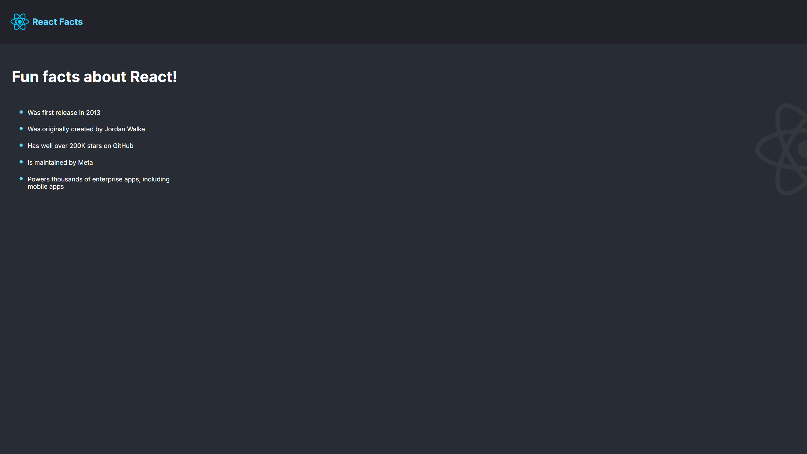
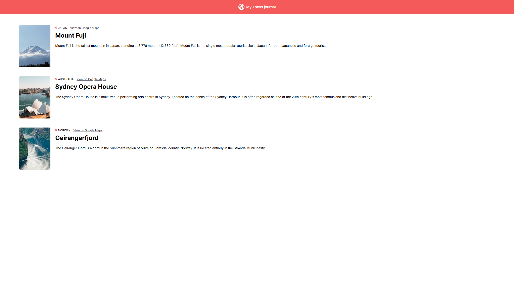
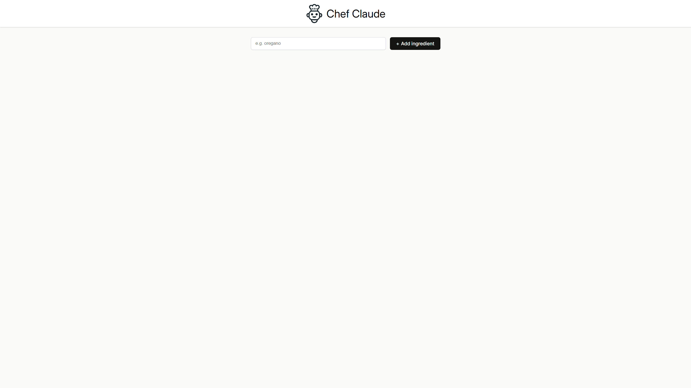

# This repo contain 3 React projects until now.

### 1. [React Facts](./react-facts/)



---

### 2. [Travel Journal](./travel-journal/)



---

### 3. [Chef Claude](./chef-claude/) (Unfinished)



---

### In order to run any of these projects all you need to have is Docker then follow these steps.

## 1- Clone this Project:

```bash
git clone https://github.com/MOKAIRY/Learn-React.git
```

## 2- Enter the directory:

```bash
cd Learn-React
```

## 3- Build image:

```bash
docker-compose build
```

## 4- Run container:

> To run all projects:

```bash
docker-compose up
```

OR

> To run one project

```bash
docker-compose up {project Name}
```

<u>note: type project name exactly like the project folder name.</u> (e.g. react-facts)

---

## Port mapping

After running the Docker container, each project will work on specific port:

- [React Facts](localhost:3001) ---> localhost:3001

- [Travel Journal](localhost:3002) ---> localhost:3002

- [Chef Claude](localhost:3003) ---> localhost:3003
